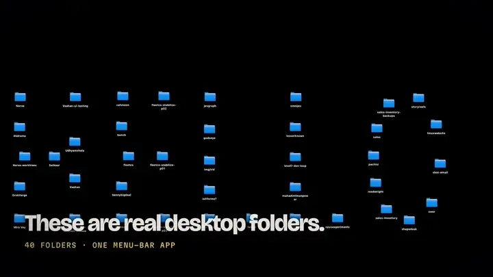

# ShapeDesk

A macOS menu bar app that arranges your real desktop icons into shapes —
heart, circle, star, spiral, wave — or spells out a word with them. Icons
morph smoothly into formation, and everything is reversible.

<p align="center">
  <a href="docs/demo.mp4">
    
  </a>
</p>
<p align="center"><a href="docs/demo.mp4"><b>▶ Watch the full 30-second demo with sound</b></a></p>

## Build & run

```sh
./bundle.sh          # builds build/ShapeDesk.app
open build/ShapeDesk.app
```

A grid icon appears in your menu bar. Click it, pick a shape, done.
"Reset to grid" puts everything back into a normal sorted grid.

## Requirements

- macOS 13 or later, Apple Silicon or Intel (Swift toolchain to build).
- **Automation permission**: on first use macOS asks to let ShapeDesk
  control Finder — click OK. If you miss it: System Settings →
  Privacy & Security → Automation → ShapeDesk → Finder.
- **Finder desktop sorting must be off**: right-click the desktop →
  *Sort By* → *None* (and keep *Stacks* off). If sorting is on, Finder
  immediately snaps icons back, undoing the shape.
- If you use iCloud "Desktop & Documents Folders", icons live in iCloud;
  the app still works, but freshly-synced items may appear unarranged.

## How it works

1. **Shape math** (`Geometry.swift`): each shape is a parametric polyline
   (e.g. the classic `16 sin³t` heart), resampled by arc length into exactly
   one point per desktop icon, then scaled and centered on your screen's
   usable area (menu bar and Dock excluded). The text mode
   (`TextShape.swift`) draws the word in capitals with a thin font, thins
   the strokes to one-pixel centerlines, puts icons on stroke ends and
   corners first, then spaces the rest evenly along the strokes. Words read
   best with about 7 or more icons per letter; the status line says so when
   a word is too long for your icon count.
2. **Finder bridge** (`FinderBridge.swift`): icon names and positions are
   read with AppleScript (`desktop position of every item of desktop`), and
   positions are written back in one `osascript` call per arrangement:
   14 smoothstep-eased frames, each frame's moves sent without waiting for
   Finder's replies, then one quick query so Finder catches up before the
   next frame. That takes about 1.2 s for 40 icons; waiting for a reply to
   every move took about 10 s.
3. **UI** (`ShapeDeskApp.swift`, `MenuBarPanel.swift`): a menu bar icon
   with a drop-down panel holding the shape grid, text field, size slider,
   and status line. The app positions the panel itself each time it opens,
   just under the icon (or under the click if macOS reports the icon
   somewhere odd) and always inside the screen. SwiftUI's `MenuBarExtra`
   trusted the reported icon position and could open off-screen.

If icons end up tighter than ~64 px apart (lots of icons, small screen),
the status line warns that they may overlap — raise the **Size** slider.

## Notes

- Icon names come from Finder and are matched back by name; two files with
  identical names on the desktop would both target the same icon (Finder
  normally prevents this).
- Animation needs to read current positions first; if the read fails it
  falls back to placing icons instantly.
